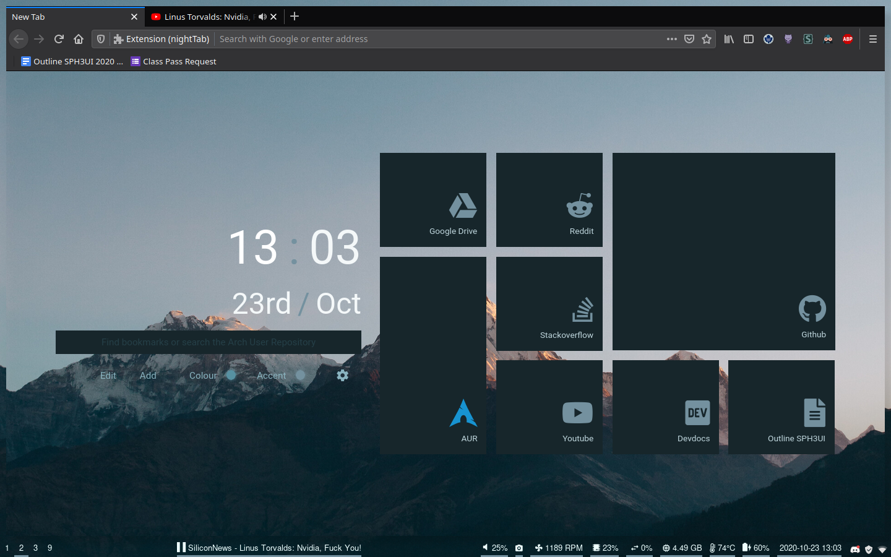

# Dotfiles

## Table of Contents
- [Repository Files](#Repository-files)
- [Licensing](#Licensing)
- [Disclamer](#Disclamer-of-Warranty)
- [Screenshots](#Screenshots)
- [Details](#Details)
- [Terminal Themes](#Terminal-themes)
- [Linux Distro](#Linux-Distro)
- [Wallpaper](#Wallpaper)
- [How to use](#Where-does-everything-go)
- [Libinput](#Libinput)

## Repository files
- README.md
- .gitattributes
- LICENSE
- fetch
- images/*

## Licensing
Everything is 0BSD Licensed, except:
- `./bin/player-status` is unlicensed, which is pretty much equivalent

## Disclamer of Warranty
I do not take responsibility if any of the files within this repository screw up your system, even if used properly. While these configuration files work on my machine, it may mess up on yours. See the [License](./license) for more details.

## Screenshots
### Desktop

### Stuff

### Vim and Ranger

### VSCode

### Firefox

## Details

`./npm-packages`, `./aur-packages`, and `./pip-packages` are just a list of packages

For NPM, you should be able to just `npm i -g $(cat ./npm-packages)`

For AUR, you should be able to just `yay -S $(cat ./aur-packages)`

For Pip, you should be able to just `pip install $(cat ./pip-packages)`

`./nightTab-backup-wallpaper.json` and `./nightTab-backup-minimal.json` are JSON data files for the [NightTab](https://github.com/zombieFox/nightTab) extension. You should be able to upload the file to get a NightTab theme.

## Terminal Themes
- The Fish theme is [bobthefish](https://github.com/oh-my-fish/theme-bobthefish)
- The Bash theme is [n5q-kitsune](https://github.com/n5q/kitsune-bash)
- The Zsh theme is [Oxide](https://github.com/dikiaap/dotfiles/blob/master/.oh-my-zsh/themes/oxide.zsh-theme)

Bash, Zsh, and Fish from top to bottom

## Linux Distro
These are meant for ArchLinux with i3 and X11. If you try on something like Manjaro they might work, but I can't be certain.

## Wallpaper:
[https://www.deviantart.com/mascaloona/art/Dakshin-641643859](https://www.deviantart.com/mascaloona/art/Dakshin-641643859)

## Where does everything go?
Pretty much everything goes in `~` or `/home/[username]`, with some execptions:
- Anything in [Repository files](#Repository-files) is excluded
- `./aur-packages` and `./npm-packages` are just plain text lists with packages to install. See [Details](#Details)
- Anything in `./etc` should go into `/etc`. If you put them in `~/etc` it won't work
    - `./etc/systemd/system/powermgmt.service` just allows the system to sleep without turning on right away

## Libinput?
Libinput allows for swiping between workspaces. I sometimes find is useful.

