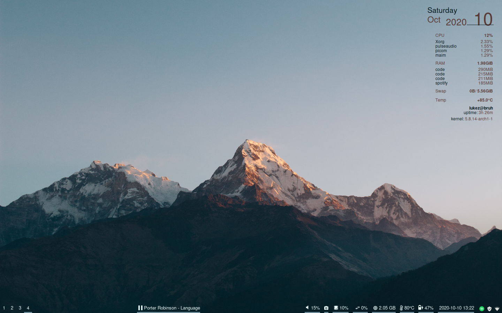
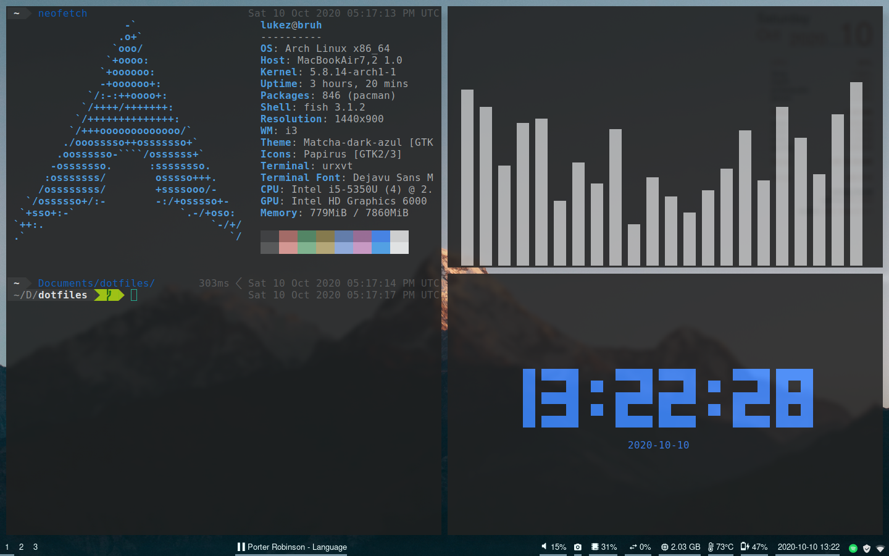
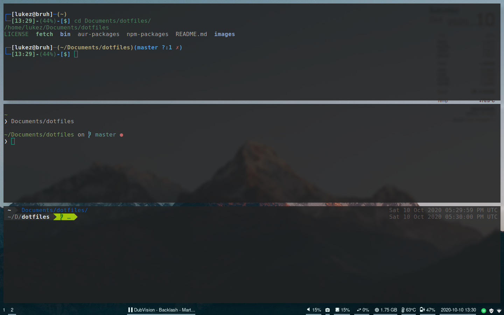
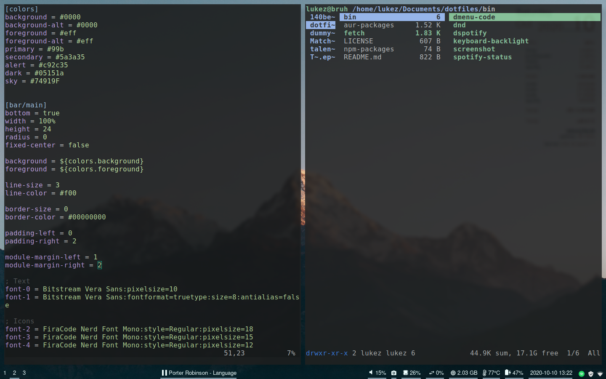
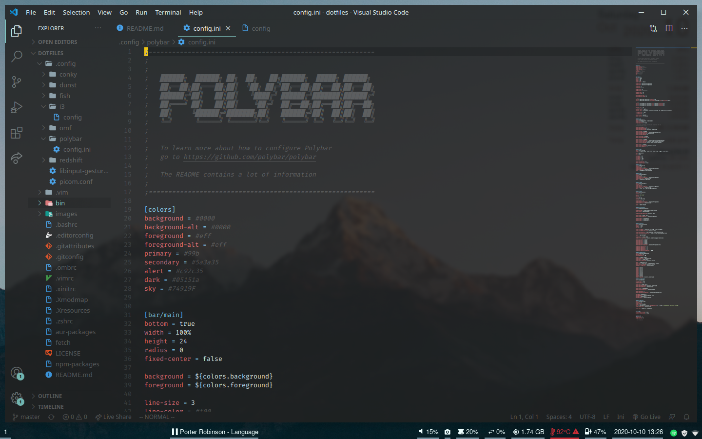

# Dotfiles

## Repository files
- README.md
- .gitattributes
- LICENSE
- fetch
- images/*

## Screenshots
### Desktop

### Stuff

### Terminals
Bash, Zsh, and Fish from top to bottom

### Vim and Ranger

### VSCode

## Details

`./npm-packages`, `./aur-packages`, and `./pip-packages` are just a list of packages

For NPM, you should be able to just `npm i -g $(cat ./npm-packages)`

For AUR, you should be able to just `yay -S $(cat ./aur-packages)`

For Pip, you should be able to just `pip install $(cat ./pip-packages)`

## Licensing
Everything is 0BSD Licensed, except:
- `./bin/player-status` is unlicensed, which is pretty much equivalent

## Linux Distro
These are meant for ArchLinux with i3 and X11. If you try on something like Manjaro I'm not sure if they'll work

## Wallpaper:
[https://www.deviantart.com/mascaloona/art/Dakshin-641643859](https://www.deviantart.com/mascaloona/art/Dakshin-641643859)

## Where does everything go?
Pretty much everything goes in `~` or `/home/[username]`, with some execptions:
- Anything in [Repository files](#Repository-files) is excluded
- `./aur-packages` and `./npm-packages` are just plain text lists with packages to install. See [Details](#Details)
- Anything in `./etc` should go into `/etc`. If you put them in `~/etc` it won't work
    - `./etc/systemd/system/powermgmt.service` just allows the system to sleep without turning on right away

## Libinput?
Libinput allows for swiping between workspaces. I sometimes find is useful.

